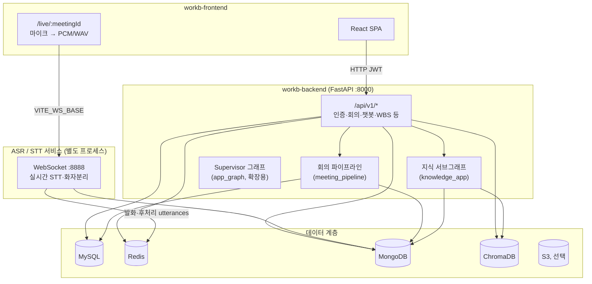

# WorkB (ProjectWorkB)


AI 회의 어시스턴트 **WorkB**의 통합 프로젝트입니다.  

프론트엔드(`workb-frontend`)와 백엔드(`workb-backend`)가 분리 저장소로 구성되며, 이 폴더는 전체 아키텍처·파이프라인을 한눈에 보기 위한 문서용 루트입니다.


| 저장소 | 역할 | 스택 |

|--------|------|------|

| [workb-frontend](../workb-frontend/Frontend/README.md) | 웹 UI, 라이브 회의 화면, 설정·온보딩 | Vite, React 18, TypeScript, Tailwind |

| [workb-backend](../workb-backend/Backend/README.md) | REST API, LangGraph 멀티 에이전트, DB·연동 | FastAPI, LangGraph, SQLAlchemy |


---


## 전체 파이프라인 (한눈에)





---


## 1. 사용자 여정 (프론트 → 백엔드)


| 단계 | 프론트 | 백엔드 / 외부 |

|------|--------|----------------|

| 가입·로그인 | `/login`, `/signup`, `/oauth/callback` | `User` 도메인, JWT, OAuth(Google·Kakao 등) |

| 온보딩 | `/onboarding/*` | `Workspace`, `Integration` — 팀·외부 연동 설정 |

| 회의 준비 | `/meetings/new`, `context`, `agenda` | `Meeting` — 예약·아젠다·사전 컨텍스트 |

| 라이브 회의 | `/live/:meetingId` | 회의 `start` API + **ASR WebSocket** 실시간 STT |

| 회의 종료 | `endWorkspaceMeeting` 호출 | `end` API → **후처리 파이프라인** (백그라운드) |

| 사후 활용 | `notes`, `wbs`, `reports`, `export` | `Action`, `Intelligence` — 회의록·WBS·보고서 |

| 챗봇·검색 | 홈·라이브 우측 패널 등 | `Knowledge` — 의도 분류 후 RAG·ReAct 에이전트 |


프론트 API 베이스: `VITE_API_BASE_URL` → `{origin}/api/v1`  

실시간 음성: `VITE_WS_BASE` (기본 `ws://localhost:8888`) — 백엔드 REST와 **별도 ASR 서버**입니다.


---


## 2. 회의 라이프사이클 파이프라인 (핵심)


회의 진행·종료 시 백엔드 `meeting_pipeline` LangGraph가 오케스트레이션합니다.


```

[회의 시작] POST .../meetings/workspaces/{ws}/{id}/start

    meeting_start → realtime_diarization → END

         │                    │

         │                    └─ Redis에 쌓인 실시간 발화 수 확인 (ASR가 기록)

         └─ MySQL 회의 상태 "진행 중"


[라이브 중] 프론트 useLiveSTT

    마이크 → WebSocket(ASR) → Redis / (후처리 후) MongoDB utterances


[회의 종료] POST .../end

    MySQL 상태 "완료" + 백그라운드 completion 파이프라인

         postprocess_diarization → wbs → minutes → END

              │                      │        │

              │                      │        └─ 회의록(MySQL) 생성

              │                      └─ WBS 템플릿 생성

              └─ Mongo utterances 대기 → 요약·액션아이템·quick_report

```


- **실시간 화자분리·STT**는 ASR 서비스가 담당하고, 백엔드는 Redis/Mongo를 **관찰·저장·후처리 연계**만 합니다.

- **종료 후처리**는 MongoDB에 후처리된 `utterances`가 올 때까지 짧게 재시도한 뒤, 요약·액션 아이템·WBS·회의록을 순차 생성합니다.


---


## 3. AI 에이전트 파이프라인 (LangGraph)


### 3-1. Supervisor 그래프 (`app_graph`) — 멀티 도메인 오케스트레이션


중앙 `SharedState`를 두고 **Supervisor**가 `next_node`로 도메인을 라우팅합니다.


```

supervisor ⇄ integration | meeting | knowledge | intelligence | vision | action | quality

```


| 도메인 | 역할 | 주요 State 키 |

|--------|------|----------------|

| Integration | OAuth·외부 연동 설정 로드 | `integration_settings` |

| Meeting | 실시간 transcript 누적 | `transcript` |

| Knowledge | RAG·챗봇·검색 | `user_question`, `chat_response`, `retrieved_docs` |

| Intelligence | 요약·결정사항 | `summary`, `decisions` |

| Vision | 화면 OCR·이미지 해석 | `screenshot_analysis` |

| Action | 액션 아이템·WBS | `wbs`, `realtime_actions` |

| Quality | 정확도·에러 모니터링 | `accuracy_score`, `errors` |


> 일부 노드는 플레이스홀더이며, 실제 챗봇·회의 후처리는 아래 **전용 그래프**에서 동작합니다.


### 3-2. Knowledge 서브그래프 (`knowledge_app`) — 챗봇 API


`POST /api/v1/knowledges/workspace/{id}/chatbot/message` 호출 시:


```

classifier (의도 분류)

    ├─ past_summary

    ├─ quick_report

    ├─ report_guide

    └─ knowledge_agent (ReAct + 도구: 검색·캘린더·내부문서 등)

```


- MongoDB 발화·ChromaDB RAG·온톨로지 컨텍스트를 조합해 답변을 생성합니다.

- 대화 로그는 MongoDB에 세션별로 저장됩니다.


### 3-3. 회의 파이프라인 (`meeting_pipeline_graph`)


위 **§2** 참고. 회의 시작/종료 API에 직접 연결됩니다.


---


## 4. 데이터 저장소 역할


| 저장소 | 용도 |

|--------|------|

| **MySQL** | 사용자·워크스페이스·회의 메타·액션 아이템·회의록 등 관계형 데이터 |

| **Redis** | 실시간 발화 스트림 (`meeting:{id}:utterances`) |

| **MongoDB** | 후처리 utterances, 회의 요약, 챗봇 히스토리 |

| **ChromaDB** | 벡터 검색·RAG |

| **S3** (선택) | 프로필·화면 캡처 등 파일 |


로컬 인프라는 백엔드 `docker-compose.yml`로 MySQL·MongoDB·Redis·ChromaDB를 띄울 수 있습니다.


---


## 5. 로컬 실행 순서 (요약)


1. **인프라** (백엔드 디렉터리): `docker compose up -d` — DB·Redis·Chroma

2. **백엔드**: `.env` 설정 후 `uvicorn app.main:app --reload` → `http://localhost:8000`

3. **ASR 서버**: 별도 실행 → WebSocket `:8888` (프론트 `VITE_WS_BASE`와 맞출 것)

4. **프론트엔드**: `.env.local`에 `VITE_API_BASE_URL=http://localhost:8000` → `npm run dev` → `http://localhost:5173`


상세 설치·환경 변수·라우트 목록은 각 저장소 README를 참고하세요.


- [workb-backend README](../workb-backend/Backend/README.md)

- [workb-frontend README](../workb-frontend/Frontend/README.md)


---


## 6. 외부 연동 (선택)


Slack, Jira, Google Calendar, Kakao 로그인 등은 `Integration` 도메인 OAuth로 연결되며, 액션 아이템·일정·알림 흐름에 사용됩니다.


---


## 디렉터리 구조 (이 루트 기준)


```

ProjectWorkB/          ← 통합 문서 (본 README)

workb-backend/         ← FastAPI + LangGraph

workb-frontend/        ← React SPA

```

